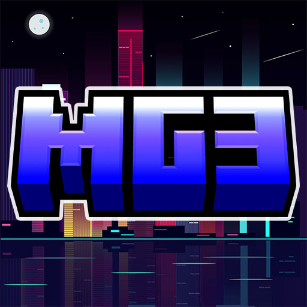

<!doctype html>
<html lang="ru">
<head>
  <meta charset="utf-8" />
  <meta name="viewport" content="width=device-width,initial-scale=1" />
  <title>MineGrad — Город возможностей</title>
  <meta name="description" content="MineGrad — роллплей сервер Minecraft. Подай заявку в вайтлист и начни свою историю. Дальше = больше." />
  <link rel="icon" href="data:;base64,iVBORw0KGgo=" />
  <link rel="apple-touch-icon" sizes="180x180" href="/apple-touch-icon.png">
  <link rel="icon" type="image/png" sizes="32x32" href="/favicon-32x32.png">
  <link rel="icon" type="image/png" sizes="16x16" href="/favicon-16x16.png">
  <link rel="manifest" href="/site.webmanifest">

  <!-- font (kept) -->
  <link href="https://fonts.googleapis.com/css2?family=Inter:wght@300;400;600;800&display=swap" rel="stylesheet">

  
</head>
<body>
  

    <header>
      

        

         
        

        

          <h1>MineGrad</h1>
          
Город возможностей. Играй. РП. Живи.

        

      

      <nav aria-label="main">
        <a class="btn" href="#apply">Подать заявку</a>
        <a class="btn ghost" href="#discord">Discord</a>
      </nav>
    </header>

    <main>
      <section class="hero">
        

          
MineGrad

          <h2 class="big">MineGrad — город возможностей.</h2>
          
Представь мир, где каждое утро начинается на оживлённой остановке — с гидом рядом и навигатором в телефоне. Здесь у тебя есть работа, дом, друзья и враги — и всё это влияет на судьбу города. Заходи сейчас — и помни: <strong>дальше = больше</strong>.

          

            
Реалистичный городской спавн и вводный гид

            
Фракции: полиция, военные, медики, СМИ

            
Уникальная рыбалка и экономика без Pay-to-Win

            
Покупка жилья через NPC и карьерные профессии

          

          

            <a class="btn" href="#apply">Подать заявку в вайтлист</a>
            <a class="btn ghost" href="#discord" style="margin-left:0">Вступить в Discord</a>
          

          
Важно: для захода на сервер обязательно подать заявку и дождаться добавления в вайтлист через Discord.

        

        

          

            <!-- single-image approach with crossfade on change (keeps repo paths intact) -->
            
            

            

              
MineGrad — вид города

              
Скриншоты сервера.

            

          

          

            

              <button class="small-btn" id="prevBtn" aria-label="Previous">⟨</button>
              

              <button class="small-btn" id="nextBtn" aria-label="Next">⟩</button>
            

            

              
Скрин 1 из 4

              

            

          

        

      </section>

      <section class="grid3">
        

          <h4>Игровая экономика</h4>
          
Стабильная модель: донат — косметика, а не преимущества. Профессии и торговля влияют на развитие персонажа.

        

        

          <h4>Фракции и сюжет</h4>
          
Фракции развиваются силами игроков — ваша активность формирует политическую и криминальную карту города.

        

        

          <h4>Механики и плагины</h4>
          
BetonQuests, NPC-покупки, паспортная система — всё уже работает, а в будущем будет ещё глубже.

        

      </section>

      <section>
        

          <h3>Что делать на сервере</h3>
          

            
Купить квартиру и открыть бизнес

            
Устроиться на работу: водитель, доставщик, полицейский

            
Участвовать в ивентах и влиять на сюжет

          

        

      </section>

      <section class="card-blur" id="rules" style="margin-top:18px">
        <h3>📜 Официальные правила MineGrad</h3>
        

          <!-- rules content unchanged -->
          

            <h4>1️⃣ Общие правила</h4>
            <ul class="rules-list">
              <li>Уважай других игроков — без оскорблений, угроз и провокаций.</li>
              <li>Запрещены любые читы, баги, дюпы и сторонние программы.</li>
              <li>Без мата, спама, чрезмерного капса и рекламы других серверов.</li>
              <li>РП-игра обязательна — соблюдай атмосферу города.</li>
              <li>Незнание правил не освобождает от ответственности. Обход наказаний запрещён.</li>
            </ul>
          

          

            <h4>2️⃣ Игровые имена и скины</h4>
            <ul class="rules-list">
              <li>Ник не должен содержать оскорблений, рекламы или мата.</li>
              <li>RP-имена — реалистичные: <strong>Имя Фамилия</strong>.</li>
              <li>Скины должны соответствовать сеттингу, запрещена экстремистская символика.</li>
              <li>При работе во фракции — форма обязательна.</li>
            </ul>
          

          

            <h4>3️⃣ Взаимодействие с миром</h4>
            <ul class="rules-list">
              <li>Гриферство запрещено — не ломай чужое и не порти город.</li>
              <li>Чат — для общения по игре, без оффтопа и спама.</li>
              <li>Запрещено злоупотреблять игровыми механиками (баги экономики, PvP и т.д.).</li>
            </ul>
          

          

            <h4>4️⃣ Фракции и конфликты</h4>
            <ul class="rules-list">
              <li>Конфликты только в рамках РП — без атак без причины.</li>
              <li>Каждая фракция выполняет свою роль, смена — только через РП.</li>
              <li>Нейтральные игроки не вмешиваются в разборки.</li>
              <li>Полиция и военные проводят аресты по закону.</li>
            </ul>
          

          <!-- responsive accordion/tabs -->
          

            <h4>5️⃣ Законы города MineGrad</h4>

            

              <button class="law-btn active" data-target="criminal" role="tab" aria-selected="true" aria-expanded="false">🔴 Уголовные преступления ▾</button>
              <button class="law-btn" data-target="administrative" role="tab" aria-selected="false" aria-expanded="false">🟡 Административные нарушения ▾</button>
            

            

              
🔴 Уголовные преступления:

              <ul class="rules-list">
                <li>Убийство без причины — 30 минут тюрьмы.</li>
                <li>Ограбление (при поимке) — 20 минут тюрьмы + штраф.</li>
                <li>Нападение на полицейского/военного — 40 минут тюрьмы.</li>
                <li>Попытка госпереворота — пожизненное заключение.</li>
              </ul>
            

            

              
🟡 Административные нарушения:

              <ul class="rules-list">
                <li>Оскорбления/провокации — штраф или 10 минут КПЗ.</li>
                <li>Незаконное проникновение — 15 минут тюрьмы.</li>
                <li>Вандализм (грифинг) — бан от 3 дней до перманента.</li>
              </ul>
            

          

        

      </section>

      <section style="margin-top:18px;display:flex;gap:18px;align-items:flex-start;flex-wrap:wrap">
        

          <h4>Соцсети MineGrad</h4>
          
Подписывайся, подавай заявку и следи за ивентами.

          

            <a class="yt" href="https://www.youtube.com/@MineGradOfficial" target="_blank" rel="noopener"> <!-- YouTube -->
              <svg viewBox="0 0 24 24" fill="none" xmlns="http://www.w3.org/2000/svg" aria-hidden="true"><path d="M23 7a3 3 0 0 0-2.1-2.15C19.4 4.5 12 4.5 12 4.5s-7.4 0-8.9.35A3 3 0 0 0 1 7v10a3 3 0 0 0 2.1 2.15C4.6 19.5 12 19.5 12 19.5s7.4 0 8.9-.35A3 3 0 0 0 23 17V7z" fill="white" opacity="0.12"/><path d="M10 15V9l5 3-5 3z" fill="white"/></svg>
              YouTube
            </a>
            <a class="tt" href="https://www.tiktok.com/@minegrad" target="_blank" rel="noopener"> <!-- TikTok -->
              <svg viewBox="0 0 24 24" fill="none" xmlns="http://www.w3.org/2000/svg" aria-hidden="true"><path d="M9 3v7.5A4.5 4.5 0 1 0 13.5 15H15a6 6 0 1 1 0 12v-5.25A9 9 0 1 1 9 3z" fill="white" opacity="0.12"/></svg>
              TikTok
            </a>
            <a class="vk" href="https://vk.com/club217846754" target="_blank" rel="noopener"> <!-- VK -->
              <svg viewBox="0 0 24 24" fill="none" xmlns="http://www.w3.org/2000/svg" aria-hidden="true"><path d="M2 2h20v20H2z" fill="white" opacity="0.06"/></svg>
              ВКонтакте
            </a>
            <a class="tg" href="https://t.me/minegradofficial" target="_blank" rel="noopener"> <!-- Telegram -->
              <svg viewBox="0 0 24 24" fill="none" xmlns="http://www.w3.org/2000/svg" aria-hidden="true"><path d="M2 12l8-4 6 5-9 5-5-6z" fill="white" opacity="0.12"/></svg>
              Telegram
            </a>
            <a class="donate" href="#donate">Поддержать проект</a>
          

        

        

          <h4>Как зайти на сервер</h4>
          <ol style="margin-top:8px;color:rgba(255,255,255,0.78);font-size:14px">
            <li>Вступи в наш Discord.</li>
            <li>Подай заявку на вайтлист в специальном канале.</li>
            <li>Дождись подтверждения — тебя добавят и пришлют IP сервера.</li>
          </ol>
          
Важно: вход на сервер доступен только после подтверждения в вайтлисте.

        

      </section>

      <footer>
        © MineGrad — проект развивается. Помни: <strong>дальше = больше</strong>.
      </footer>

    </main>
  

  
</body>
</html>
